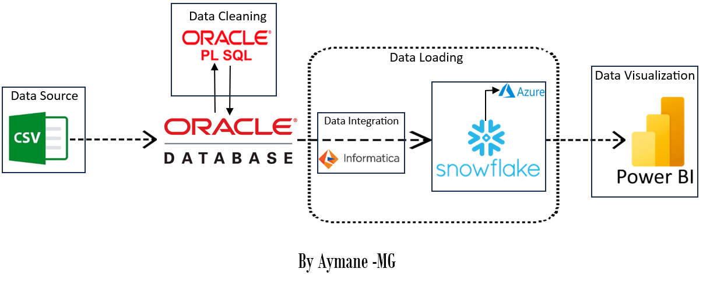
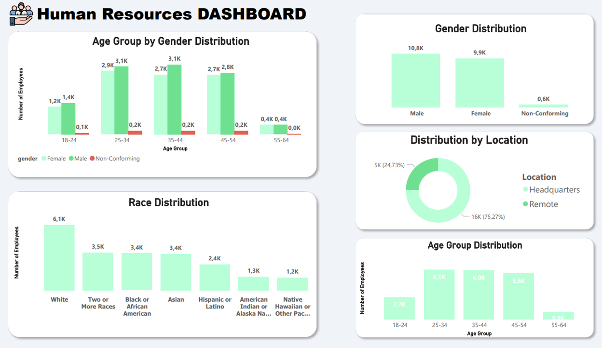

# Human Resources ETL Project

## Table of Contents
1. [Project Overview](#project-overview)
3. [Technologies Used](#technologies-used)
4. [Data Pipeline](#data-pipeline)
5. [ETL Process](#eTL-process)
6. [Repository Structure](#repository-structure)
7. [How to Run](#how-to-run)
8. [Dashboard](#dashboard)
9. [Acknowledgments](#acknowledgments)
10. [Conclusion](#conclusion)
11. [Contacts](#contacts)

## Project Overview

This ETL (Extract, Transform, Load) project aims to extract human resources data, clean it using PL/SQL and SQL, integrate it into a Snowflake data warehouse on Azure Cloud using Informatica, and visualize the insights in Power BI.

## Technologies Used

- Oracle Database
- PL/SQL
- SQL
- Informatica
- Snowflake Data Warehouse
- Azure Cloud
- Power BI

## Data Pipeline

Here is  the HR data pipeline :




## ETL Process

1. **Data Extraction**: Human resource data was extracted from the csv file (HR.csv).
2. **Data Loading**: The data was loaded into the Oracle Database.
3. **Data Cleaning**: Extensive data cleaning and transformation were performed using PL/SQL and SQL scripts.
4. **Data Integration**: Cleaned data was integrated into Snowflake Data Warehouse using Informatica.
5. **Visualization**: Snowflake Data Warehouse was connected to Power BI for data visualization.

### Repository Structure

```plaintext
Human-Resources-ETL-Project
│   README.md
│
└── Main
    │   data_cleaning.sql
    │   HR_Dashboard.pbix
    │
    ├── database for PowerBI
    │       age_group.csv
    │       age_group_gender.csv
    │       avg_length_employment.csv
    │       avg_tenure.csv
    │       data_generation.sql
    │       employee_change.csv
    │       gender.csv
    │       gender_department.csv
    │       HR.csv
    │       jobtitle.csv
    │       location.csv
    │       race.csv
    │       state.csv
    │       turnover_rate.csv
    │
    ├── dataset
    │       HR.csv
    │
    └── images
            dashboard.png
            hr_data_pipeline.png
```

## How to Run

To run this project, follow these steps:

1. Set up an Oracle Database and Snowflake Data Warehouse.
2. Execute `data_cleaning.sql` and `data_generation.sql` in the Oracle Database to perform data cleaning and generate additional data.
3. Configure Informatica to connect to your Oracle Database and Snowflake Data Warehouse.
4. Use Informatica to create ETL workflows to load and transform the data.
5. Import `HR_Dashboard.pbix` into Power BI to visualize the data.

## Dashboard

Here is  the HR Dashboard created in Power BI:




## Acknowledgments

I would like to express our gratitude to the following resources for their valuable contributions to this project:

The official documentation of `oracle database`.

The documentation provided by `informatica` for data integration

The `snowflake` documentation, which aided in loaded the data into  data warehouse.

## Conclusion

This project demonstrates the end-to-end ETL process for human resources data, from extraction and cleaning to integration and visualization. Feel free to explore the provided resources and code to gain insights from your HR data. :)

## Contacts

For any questions or inquiries related to this project, please feel free to contact me :)

- linkedin : <a href="https://www.linkedin.com/in/aymane-maghouti/" target="_blank">Aymane Maghouti</a><br>
- Email: `aymanemaghouti@gmail.com`